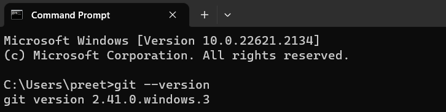
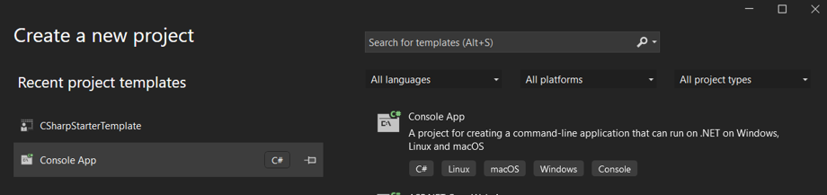

# SIMPLE PROJECT WITH GIT IN VISUAL STUDIO

### TASK 1 : SETTING UP ENVIRONMENT
- Git and Visual Studio has been successfully installed.

    **GIT :**

    

    **VISUAL STUDIO :**

    

- New project [console-based application] has been created. 

    